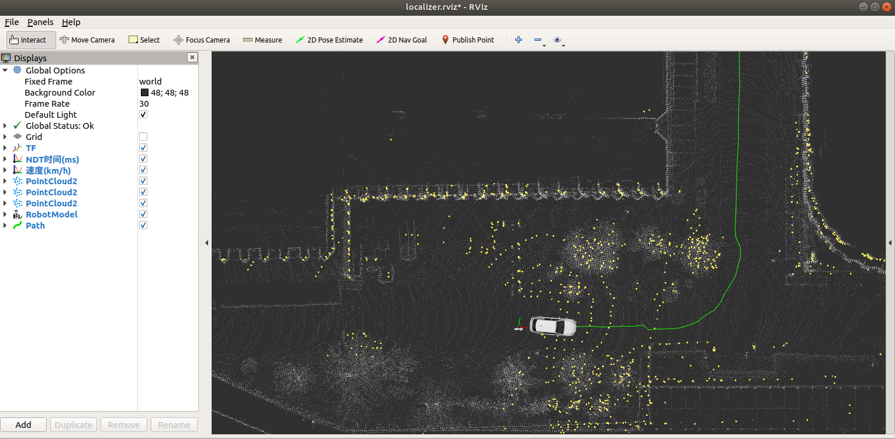

# Waypoints Processor




> To run this project, you need to complete the localization first.  
> Here is a project [ROS_NDT_Localizer](https://github.com/leofansq/ROS_NDT_Localizer) may help :)

## Environment
* Ubuntu 18.04
* ROS Melodic

## Waypoints Recorder
Generate the waypoints according to the position & orientation, and save the records.

### Data
* RosBag for offline testing

### IO
- input  
/ndt_pose (geometry_msgs::PoseStamped)   
- output  
/waypoint_marker (visualization_msgs::Marker) for visualization on RVIZ  
waypoints records in .txt format

### How to use
* Complete the localization steps, e.g. [ROS_NDT_Localizer](https://github.com/leofansq/ROS_NDT_Localizer).
* Set the configuration in [record_waypoints](./record_waypoints.py)
  ```python
  # line 75
  waypoint_recorder(sub="/ndt_pose", file_name='./waypoints.txt', interval=1)
  ```
* Run the waypoint recorder, and the record will stored in the [waypoint_files](./waypoints_files/).
  ```bash
  python record_waypoints.py
  ```
  > the recorded waypoints are organized as follow:  
  > position.x,position.y,position.z,orientation.x,orientation.y,orientation.z,orientation.w

* Play the rosbag for offline testing
  ```bash
  rosbag play offline_testing.bag
  ```

## Waypoints Loader
Load and publish the waypoints record.

### Data
* Waypoints record file (.txt format)
* RosBag for offline testing

### IO
- input  
waypoints records in .txt format  
- output  
/waypoints (nav_msgs::Path)

### How to use
* Complete the localization steps, e.g. [ROS_NDT_Localizer](https://github.com/leofansq/ROS_NDT_Localizer).
* Set the configuration in [load_waypoints](./load_waypoints.py)
  ```python
  # line 59
  waypoints_path = "./waypoints_files/waypoints.txt"
  ```
* Run the waypoint loader  
  ```bash
  python load_waypoints.py
  ```

## Related projects in pure ROS (Melodic) 

* [ROS_NDT_Mapping](https://github.com/leofansq/ROS_NDT_Mapping)
* [ROS_NDT_Localizer](https://github.com/leofansq/ROS_NDT_Localizer)
* [ROS_Pure_Pursuit](https://github.com/leofansq/ROS_Pure_Pursuit)
* [ROS_Object_Cluster](https://github.com/leofansq/ROS_Object_Cluster)
